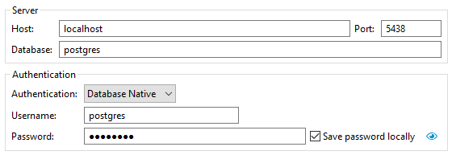
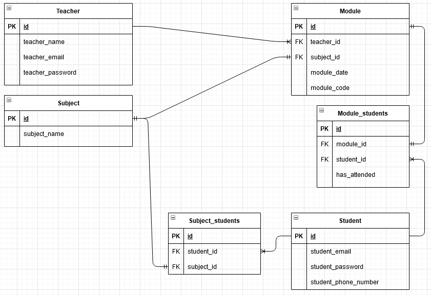

# DLS-ExamProject
This is the repository for my Development of Large Systems exam project: [Online Repository.](https://github.com/FrederikBlem/DLS-ExamProject)
The project is based upon the DLS subject's assignment 2 description:<br>
[Assignment 2 Document.](Documents/assignment2.pdf)

## Docker setup (and reset)

First time setup is done simply from the RollCall directory with the command:
```
docker-compose up
```
This creates the Postgres database, creates tables, fills the tables with some sample data and creates stored functions and procedures from the prepared scripts in the sql folder.
If you want to reset the database and fill it with the original data again, do so by running:
```
docker-compose down
```
Then **delete the postgres-data folder in the RollCall folder** and compose up again. This allows Docker to initiate from the sql-files in the sql folder again.

## Connecting to the database



The database can be connected to with the following details:
```
port: 5438
username: postgres
password: postgres
```

## Documentation, Database Structure & Methodology
The original idea for this solo project was outlined in this document:<br>
[Project Idea Document v1.](Documents/Project_Idea_Document_v1.pdf)

At the moment the database is modelled after this diagram, which is version 2:


In order to wrap my head around the needed tasks, I made: [a simple Google Docs document for tracking them in user story format with dates added upon completion.](https://docs.google.com/document/d/1qgIEwmZaRYmEtGuFhZ3Tm7_wHyCYalyYmekJgt_QTjg/edit?usp=sharing)

## Next steps and issues
* The RollCall project needs quite a lot of work on the desired core functions. <br>I intend to create procedures in Postgresql for some or all of these. <br>I want to implement REST to allow for Postman calls of the service.
* I haven't decided how to handle the attendance code generation yet. At the moment you declare it yourself when creating the module.
* I haven't decided how to handle the check-in time limit yet.

### Security and authentication issues as results of time-saving corner cutting.
* Authentication will happen simply by supplying teacher_id or student_id and matching password when querying.
* Passwords are stored as plain text.
* Module attendance codes are stored as plain text.