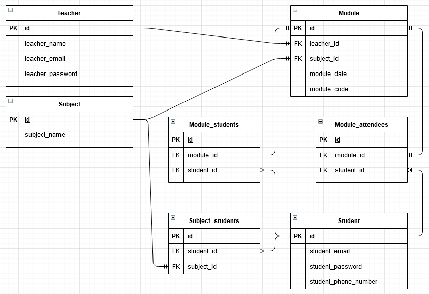

# DLS-ExamProject
This is the repository for my Development of Large Systems exam project.
The project is based upon the DLS subject's assignment 2:<br>
[Assignment 2 Document.](Documents/assignment2.pdf)

## Docker setup (and reset)

First time setup is done simply from the RollCall directory with the command:
```
docker-compose up
```
This creates the Postgres database, creates tables and fills the tables with the prepared scripts in the sql folder.
If you want to reset the database and fill it with the original data again, do so by running:
```
docker-compose down
```
Then **delete the postgres-data folder in the RollCall folder** and compose up again. This allows Docker to initiate from the sql-files in the sql folder again.

## Connecting to the database


The database can be connected to with the following details:
```
port: 5438
username: postgres
password: postgres
```

## Database structure

At the moment the database is modelled after this diagram:


## Next steps and issues

The original idea for this solo project was outlined in this document:<br>
[Project Idea Document v1.](Documents/Project_Idea_Document_v1.pdf)

* The RollCall project needs quite a lot of work on the desired core functions. <br>I intend to create procedures in Postgresql for some or all of these.
* I haven't decided how to handle the attendance code generation yet.
* I haven't decided how to handle the check-in time limit yet.
* I'm cutting corners on security in order to save time.
